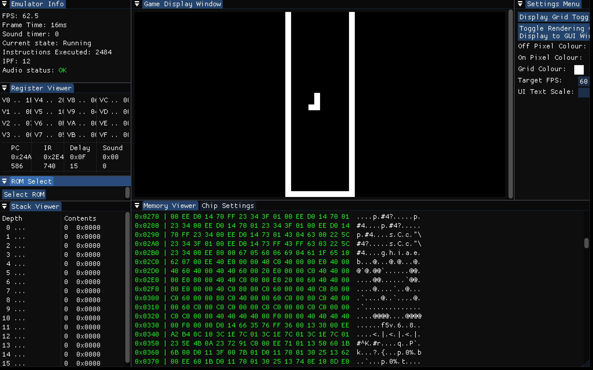
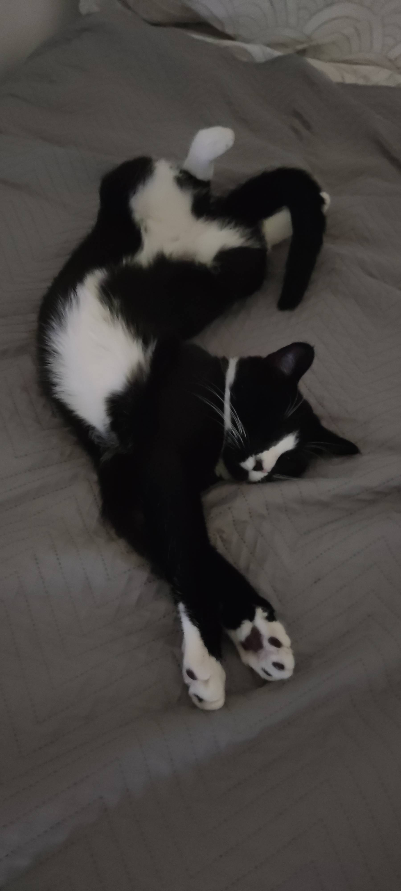

# WORK IN PROGRESS: Will add building instructions soon

# Overview
This is a fully functional emulator/interpreter for the CHIP-8. It is written in C++, and uses the following librariesd:
 - SDL2 - for graphics, input handling and audio
 - ImGui and ImGuiFileDialog - for GUI

## Usage instructions:
### Input:
#### CHIP-8 input
- Input mapping is as follows:
  <pre>
   CHIP-8 Keypad   Keyboard   
     +-+-+-+-+    +-+-+-+-+  
     |1|2|3|C|    |1|2|3|4|  
     +-+-+-+-+    +-+-+-+-+  
     |4|5|6|D|    |Q|W|E|R|  
     +-+-+-+-+ => +-+-+-+-+  
     |7|8|9|E|    |A|S|D|F| 
     +-+-+-+-+    +-+-+-+-+ 
     |A|0|B|F|    |Z|X|C|V|  
     +-+-+-+-+    +-+-+-+-+   
  </pre>
  Note: input mapping is currently not user configurable but this may change in the future.
#### Changing Emulator State (running -> debug and vice versa)
- Press '6' on keyboard to activate debug state, '0' to deactivate
- While in debug state, there are 2 debug modes you can use.
  - Step (press '7' to swap to it), which will make the emulator step through a frame everytime you press 'space'
  - Manual (press '8' to swap to it), which will make the emulator step through a single instruction everytime you press 'I'. Will add more things in the future. 
#### Toggling GUI windows
- Press 'G' on keyboard to toggle the ImGui windows

#### Usage notes
- When you first run the program, the GUI windows will all popup in one place and may not be sized the way you want. This is intended. Make sure to size and place the GUI windows as you'd like (you can dock them into one another), and the layout you have will be saved for the next time you run the program (layout is saved in "imgui.ini")
- Using the GUI windows you can do things like enable/disable quirks, load ROMs, change the emulator colour scheme, edit run-time settings like instructions-per-frame (to be executed).
- => if you have any suggestions on what new GUI features to add, let me know!

##### Example UI Layout that you could copy

Will add more features and make key mapping configurable in the future!
## Other notes:
- There is *alot* of static casting going on in the code, because I have narrowing conversions disabled on my compiler. Most arithmetic and logic operations promote to int, so doing something like Unsigned & Unsigned will create a (signed) int temporary and require the result to be casted back to unsigned

## References used for gathering the CHIP-8 specification (these are the main ones):
- https://en.wikipedia.org/wiki/CHIP-8 For general information on how everything is structured, as well as opcode specifications
- http://devernay.free.fr/hacks/chip8/C8TECH10.HTM - For opcode specifications
- https://tobiasvl.github.io/blog/write-a-chip-8-emulator/ - For information regarding quirks/ambiguous instructions as well as typical keyboard-to-input mappings

- Random.h file from [https://www.learncpp.com/](https://www.learncpp.com/cpp-tutorial/global-random-numbers-random-h/) (highly recommend this resource! its great)

## Honourable mention: Tommy
This is not at all relevant to the emulator but here is a cute picture of my cat Tommy:

